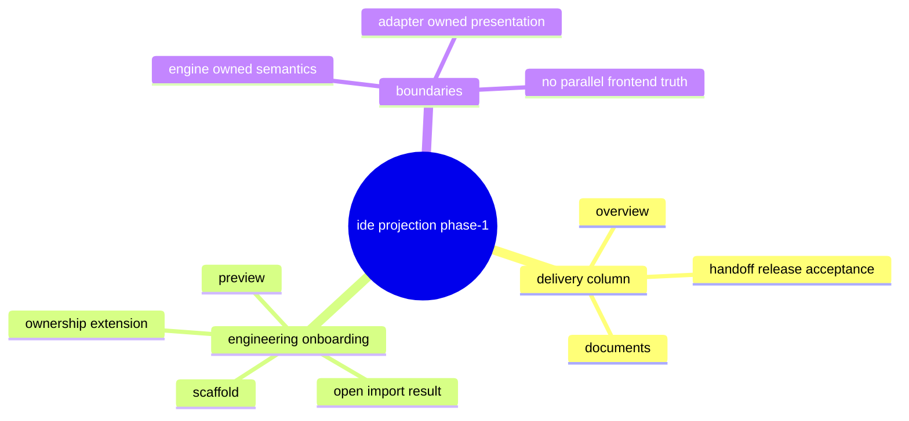

# Problem Domain Mind Map

## Root Problem

- IDE needs a new `Delivery` column/view and cleaner engineering onboarding semantics, but current upstream contracts are too broad or too implicit.

## Domain Mind Map

## Layered Exploration Chain

- Layer 1: clarify the smallest engine-owned payload needed for IDE phase-1
- Layer 2: split delivery projection from engineering onboarding
- Layer 3: split onboarding preview/open from scaffold/ownership extension
- Layer 4: defer multi-agent collaboration runtime to its own program line

## Closed-Loop Research Coverage Matrix

| Dimension | Status | Note |
| --- | --- | --- |
| scene_boundary | covered | limited to IDE delivery/onboarding projection phase-1 |
| entity | covered | scene, spec, task, delivery object, engineering project, workspace |
| relation | covered | delivery object -> scene/spec/task, app -> engineering workspace |
| business_rule | covered | engine owns semantics, adapters do not own parallel truth |
| decision_policy | covered | delivery projection first, onboarding split, scaffold deferred to phase-2 |
| execution_flow | covered | program -> child specs -> phase-1 then phase-2 |
| failure_signal | covered | broad specs, mixed ownership, frontend field synthesis |
| debug_evidence_plan | covered | strategy assess + command surface review + spec boundary review |
| verification_gate | covered | spec strategy fit, tasks coherence, boundary review |

## Correction Loop

- Trigger: a child spec grows to mix unrelated projection concerns again
- Action: split the spec before implementation and keep the master defer list explicit
