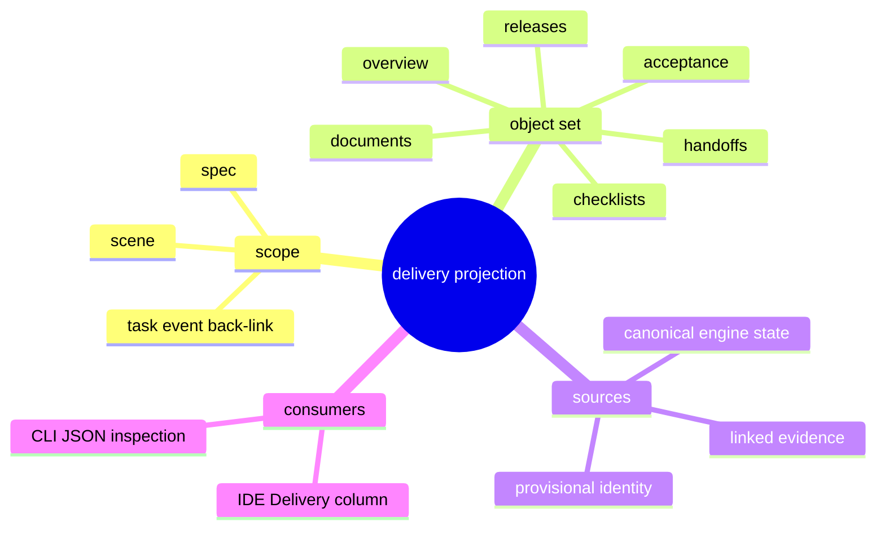

# Problem Domain Mind Map

## Root Problem

- IDE needs a new `Delivery` column, but SCE does not yet expose one stable delivery-governance projection payload.

## Domain Mind Map

## Layered Exploration Chain

- Layer 1: define the smallest stable envelope the IDE can consume
- Layer 2: map existing engine and evidence sources into one projection
- Layer 3: expose one command surface without introducing UI coupling

## Closed-Loop Research Coverage Matrix

| Dimension | Status | Note |
| --- | --- | --- |
| scene_boundary | covered | scoped to scene delivery projection for phase-1 |
| entity | covered | delivery projection, delivery record, scene, spec, task, release evidence |
| relation | covered | delivery record -> scene/spec/task/evidence |
| business_rule | covered | frontend cannot own delivery truth |
| decision_policy | covered | read-heavy first, provisional ids explicit |
| execution_flow | covered | define envelope -> source mapping -> command surface |
| failure_signal | covered | mixed file heuristics, unstable ids, frontend synthesis |
| debug_evidence_plan | covered | compare existing release/handoff evidence and scene state inputs |
| verification_gate | covered | payload schema review and scope linkage review |

## Correction Loop

- Trigger: a proposed field has only adapter meaning or cannot be mapped to engine/evidence truth
- Action: drop or mark it provisional instead of pretending it is canonical
