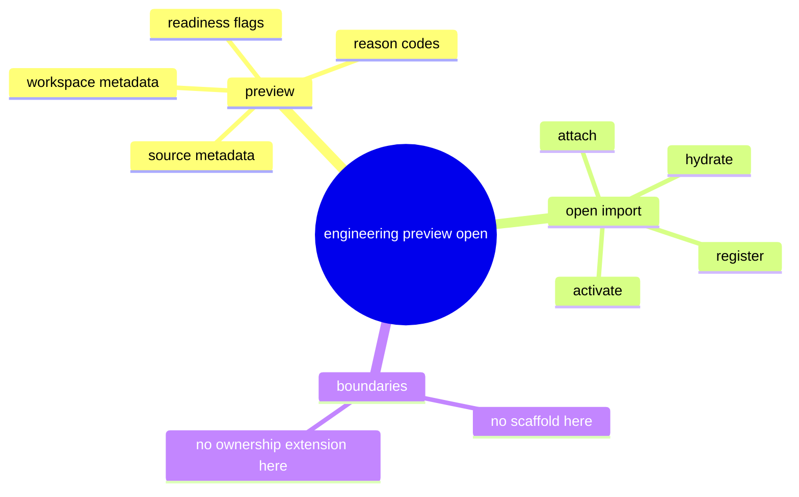

# Problem Domain Mind Map

## Root Problem

- IDE and CLI still infer engineering project readiness from multiple partial commands instead of one canonical preview/open contract.

## Domain Mind Map

## Layered Exploration Chain

- Layer 1: define one preview payload
- Layer 2: define one open/import result envelope
- Layer 3: reuse existing engineering commands instead of creating a parallel path

## Closed-Loop Research Coverage Matrix

| Dimension | Status | Note |
| --- | --- | --- |
| scene_boundary | covered | scoped to engineering preview/open envelope only |
| entity | covered | app, engineering project, workspace, preview, step result |
| relation | covered | app -> engineering project -> workspace -> readiness |
| business_rule | covered | adapter should not synthesize canonical readiness |
| decision_policy | covered | scaffold and ownership are intentionally deferred |
| execution_flow | covered | preview first, then open/import result |
| failure_signal | covered | mixed partial reads, ambiguous readiness, adapter inference |
| debug_evidence_plan | covered | compare existing `app engineering` read and action surfaces |
| verification_gate | covered | reason-code and step-envelope review |

## Correction Loop

- Trigger: the spec starts to absorb scaffold or ownership semantics again
- Action: keep those concerns in `133-03`
