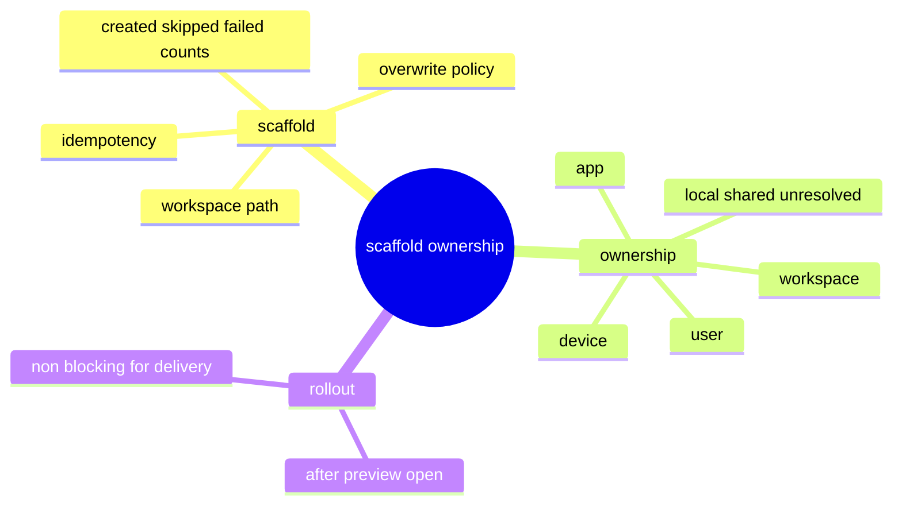

# Problem Domain Mind Map

## Root Problem

- SCE still needs canonical scaffold and ownership semantics, but those concerns should not widen the first IDE-facing rollout.

## Domain Mind Map

## Layered Exploration Chain

- Layer 1: define scaffold result contract
- Layer 2: define ownership extension point
- Layer 3: keep both concerns non-blocking for phase-1 delivery rollout

## Closed-Loop Research Coverage Matrix

| Dimension | Status | Note |
| --- | --- | --- |
| scene_boundary | covered | scoped to scaffold and ownership extension only |
| entity | covered | workspace, scaffold_result, ownership_relation, user, device |
| relation | covered | app/workspace/user/device ownership links |
| business_rule | covered | no adapter-owned ownership registry |
| decision_policy | covered | later-phase extension, not phase-1 blocker |
| execution_flow | covered | scaffold result then ownership extension |
| failure_signal | covered | over-wide onboarding spec, duplicated local ownership truth |
| debug_evidence_plan | covered | compare current engineering flows and local ownership assumptions |
| verification_gate | covered | idempotency and ownership-boundary review |

## Correction Loop

- Trigger: this spec starts to absorb preview/open semantics again
- Action: keep preview/open in `133-02` and preserve the rollout order
