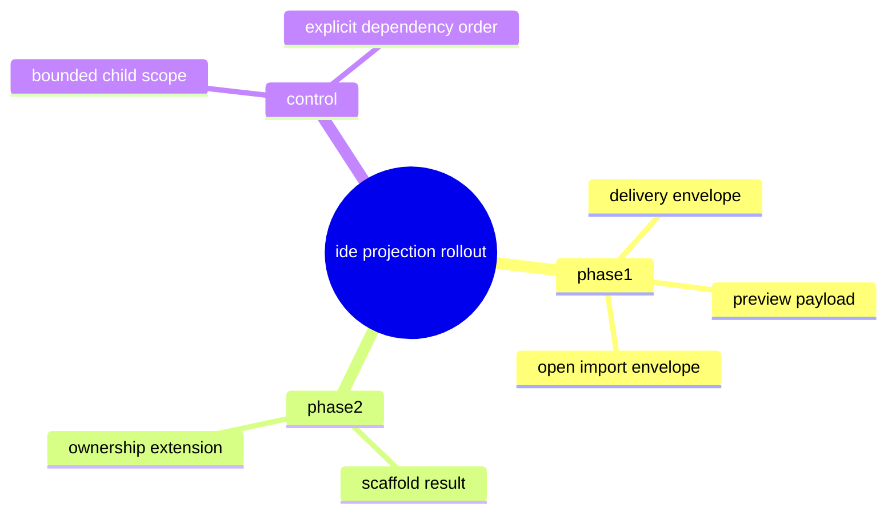

# Problem Domain Mind Map

## Root Problem

- The IDE projection line still needs a smaller, phaseable spec portfolio before implementation can proceed safely.

## Domain Mind Map

## Layered Exploration Chain

- Layer 1: lock the rollout boundary
- Layer 2: lock the child spec order
- Layer 3: keep each child spec bounded

## Closed-Loop Research Coverage Matrix

| Dimension | Status | Note |
| --- | --- | --- |
| scene_boundary | covered | scoped to the IDE projection rollout program |
| entity | covered | rollout program, child spec, phase |
| relation | covered | program -> child spec dependency |
| business_rule | covered | bounded child scope only |
| decision_policy | covered | phase-1 first, phase-2 after stabilization |
| execution_flow | covered | order child specs by dependency |
| failure_signal | covered | broad mixed drafting returns |
| debug_evidence_plan | covered | compare strategy assess output for each child spec |
| verification_gate | covered | domain coverage and strategy assess for child specs |

## Correction Loop

- Trigger: a child spec starts to absorb an adjacent contract
- Action: move the concern back to the correct child spec instead of widening the current one
