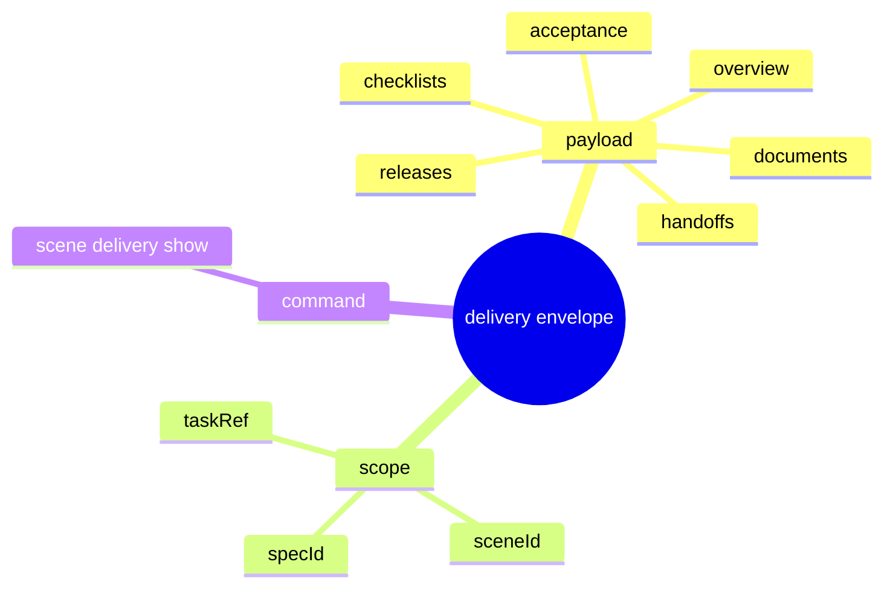

# Problem Domain Mind Map

## Root Problem

- The IDE `Delivery` column still lacks one canonical scene payload and command.

## Domain Mind Map

## Layered Exploration Chain

- Layer 1: lock the payload shape
- Layer 2: lock the scope back-links
- Layer 3: lock the command

## Closed-Loop Research Coverage Matrix

| Dimension | Status | Note |
| --- | --- | --- |
| scene_boundary | covered | scene-scoped delivery projection only |
| entity | covered | delivery projection and delivery query |
| relation | covered | delivery query returns delivery projection |
| business_rule | covered | no adapter-owned delivery truth |
| decision_policy | covered | one JSON command returns one payload |
| execution_flow | covered | request payload from scene scope |
| failure_signal | covered | payload missing or scope links guessed |
| debug_evidence_plan | covered | compare command output with current scene evidence |
| verification_gate | covered | envelope review and command review |

## Correction Loop

- Trigger: a proposed field has no stable source
- Action: keep it provisional or omit it
