# Problem Domain Mind Map

## Root Problem

- Engineering project readiness still lacks one canonical preview payload.

## Domain Mind Map

```mermaid
mindmap
  root((engineering preview))
    source
      repo
      branch
      code version
    workspace
      workspace path
      attached
      hydrated
      active
    readiness
      sourceKnown
      projectionReady
      reason codes
```

## Layered Exploration Chain

- Layer 1: lock the preview fields
- Layer 2: lock the reason codes
- Layer 3: bind the payload to the preview path

## Closed-Loop Research Coverage Matrix

| Dimension | Status | Note |
| --- | --- | --- |
| scene_boundary | covered | engineering project preview only |
| entity | covered | engineering preview and readiness reason |
| relation | covered | preview carries readiness reason codes |
| business_rule | covered | no local readiness synthesis |
| decision_policy | covered | reuse the current preview path |
| execution_flow | covered | request preview payload by app id |
| failure_signal | covered | preview path returns partial or guessed state |
| debug_evidence_plan | covered | compare preview payload with current engineering state |
| verification_gate | covered | preview shape review and reason-code review |

## Correction Loop

- Trigger: preview starts to absorb open/import step state
- Action: keep step state in the next child spec
