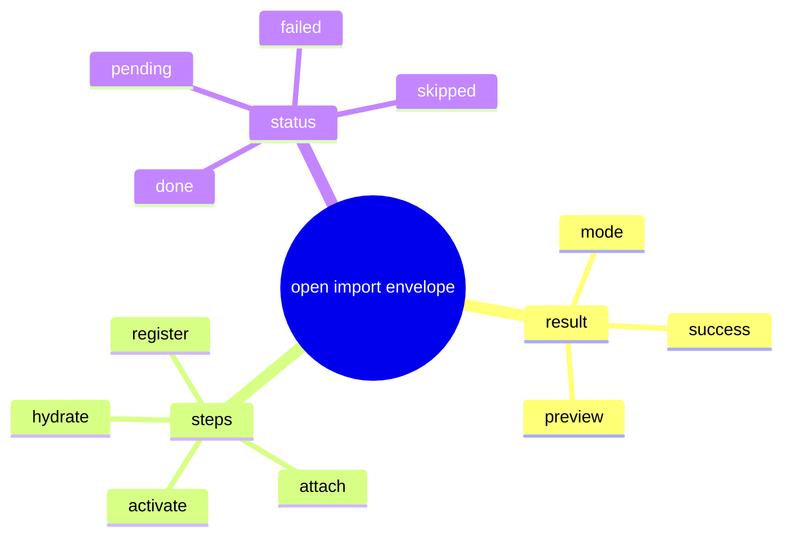

# Problem Domain Mind Map

## Root Problem

- Engineering `open` and `import` still lack one canonical result envelope.

## Domain Mind Map

## Layered Exploration Chain

- Layer 1: lock the result envelope
- Layer 2: lock the step order
- Layer 3: bind the envelope to current action paths

## Closed-Loop Research Coverage Matrix

| Dimension | Status | Note |
| --- | --- | --- |
| scene_boundary | covered | engineering open/import result only |
| entity | covered | open result and step result |
| relation | covered | open result carries ordered step results |
| business_rule | covered | non-applicable work reports `skipped` |
| decision_policy | covered | reuse the current action paths |
| execution_flow | covered | run action path and return ordered result |
| failure_signal | covered | step state is hidden or guessed |
| debug_evidence_plan | covered | compare current action output with ordered step result |
| verification_gate | covered | result-envelope review and step-order review |

## Correction Loop

- Trigger: the spec starts to redefine preview readiness
- Action: keep readiness state in `134-02`
