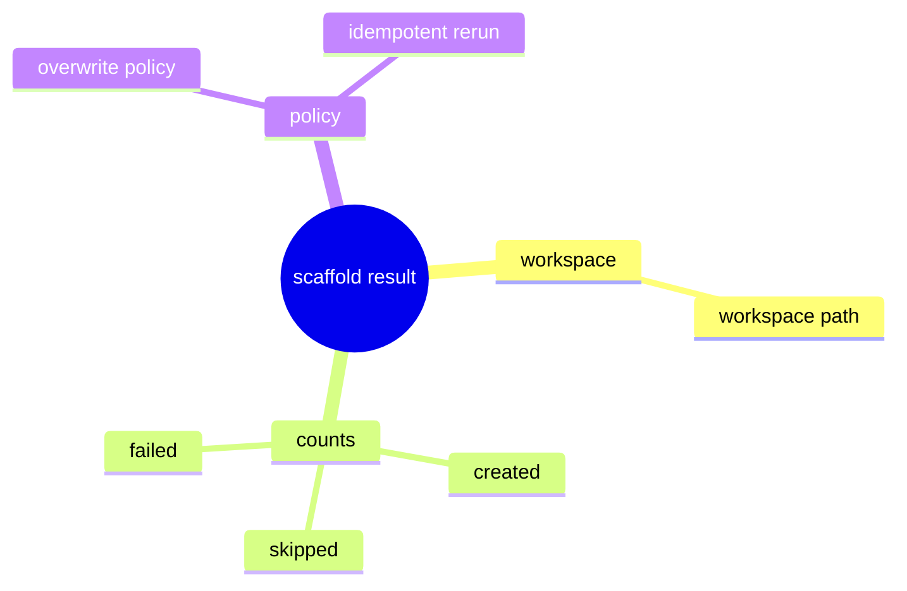

# Problem Domain Mind Map

## Root Problem

- Engineering scaffold work still lacks one canonical result contract.

## Domain Mind Map

## Layered Exploration Chain

- Layer 1: lock the result fields
- Layer 2: lock repeated-run reporting
- Layer 3: keep scaffold as phase-2 work

## Closed-Loop Research Coverage Matrix

| Dimension | Status | Note |
| --- | --- | --- |
| scene_boundary | covered | scaffold result only |
| entity | covered | scaffold result and overwrite policy |
| relation | covered | scaffold result reports overwrite policy |
| business_rule | covered | repeated runs report skipped work |
| decision_policy | covered | scaffold stays phase-2 |
| execution_flow | covered | run scaffold and return counts |
| failure_signal | covered | scaffold output hides repeated-run state |
| debug_evidence_plan | covered | compare scaffold output from first and repeated runs |
| verification_gate | covered | scaffold-result review and idempotent review |

## Correction Loop

- Trigger: preview or open/import concerns are pulled into this spec
- Action: keep scaffold limited to setup result reporting
