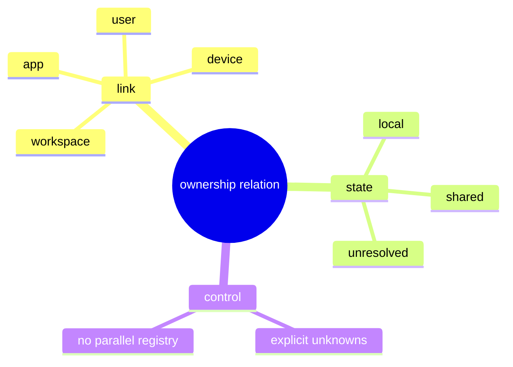

# Problem Domain Mind Map

## Root Problem

- Engineering projection still lacks one canonical ownership relation shape.

## Domain Mind Map

## Layered Exploration Chain

- Layer 1: lock the relation fields
- Layer 2: lock the ownership states
- Layer 3: keep ownership as phase-2 work

## Closed-Loop Research Coverage Matrix

| Dimension | Status | Note |
| --- | --- | --- |
| scene_boundary | covered | ownership relation only |
| entity | covered | ownership relation and ownership state |
| relation | covered | ownership relation links identity fields |
| business_rule | covered | unknown links stay explicit |
| decision_policy | covered | no parallel ownership registry |
| execution_flow | covered | project stable ownership relation state |
| failure_signal | covered | ownership is guessed or duplicated locally |
| debug_evidence_plan | covered | compare projected links with current engineering identity state |
| verification_gate | covered | ownership-shape review and unknown-link review |

## Correction Loop

- Trigger: storage design or delivery projection scope is mixed into this spec
- Action: keep this spec limited to the relation shape
