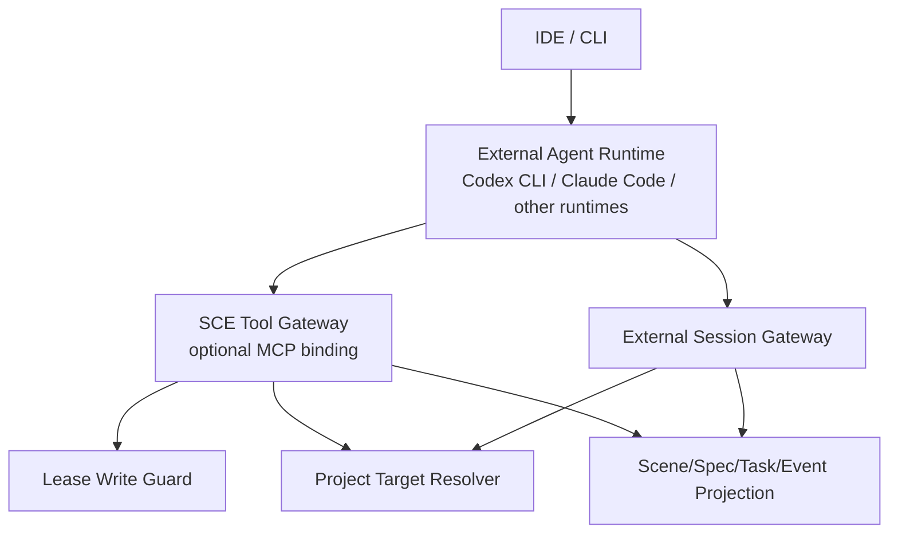

# 设计文档：External Agent Runtime And MCP Contract

## 概述

SCE 需要一个统一的“外部 agent runtime 合同层”，使 IDE 或 CLI 可以把 `Codex CLI`、`Claude Code`、MCP-capable runtime 等执行端接到同一套场景能力引擎之上。设计重点不是内建某个供应商，而是提供一组稳定的：

- canonical tool surface
- optional MCP binding
- session / progress / completion envelope
- project routing / caller context contract
- lease-aware write guard
- occupancy / supervision projection

## 架构



## 组件设计

### 1. Tool Gateway

对外暴露工具分组：

- `scene.*`
- `spec.*`
- `task.*`
- `event.*`
- `project.*`
- `lease.*`

设计要求：

- read / write 分层明确
- tool 输入输出保持 machine-readable
- 所有 write tool 统一走 `Lease Write Guard`
- 当 runtime 支持 MCP 时，可把该层绑定到 MCP；当 runtime 不支持 MCP 时，可通过 CLI bridge / process bridge 复用同一语义

### 2. External Session Gateway

负责外部 runtime 的 session identity 与状态上报。

建议 envelope：

```yaml
sessionId: string
requestId: string
agentId: string
backend: string
projectId: string
workspaceId: string
sceneId: string
specId: string
taskRef: string
stage: string
status: running|blocked|completed|failed
summary: string
reasonCode: string
rawRef: string
updatedAt: string
```

### 3. Lease Write Guard

统一校验：

- auth lease
- scope lease
- resolved project target
- tool-level write permission

若不满足条件：

- 返回 canonical blocked envelope
- 返回 machine-readable reason code
- 不允许 runtime 以“先写后验”方式绕过

### 4. Project Target Resolver

外部 runtime 不是项目真相源。

职责：

- 接收 caller context
- 解析 target project
- 返回 resolved / ambiguous / unresolved contract
- 在 session envelope 中持续 echo 命中结果

### 5. Occupancy / Supervision Projection

外部 runtime 一旦承接任务，就进入 SCE 的监管投影。

建议投影字段：

- backend
- agentId
- sessionId
- projectId
- scope level / sceneId / specId / taskRef
- status
- updatedAt

## Runtime 适配策略

首批推荐模式：

1. `IDE embedded Codex CLI + SCE tool/session contract`
2. `IDE embedded Claude Code + SCE tool/session contract`
3. `MCP-capable runtime + optional SCE MCP binding`
4. `IDE/CLI 继续负责 UI 与请求受理`
5. `SCE 提供语义、路由、租约、投影`

不建议让 engine 直接依赖：

- 任何供应商 GUI
- ACP provider UI
- 供应商私有状态词汇

## 兼容策略

- 合同以 vendor-neutral schema 为中心，不以 `openhands_*`、`codex_*`、`claude_*` 命名。
- IDE 若未使用外部 runtime，现有 native 执行链路不受影响。
- 后续新 runtime 只需适配同一套 tool + session contract；MCP 只是其中一种绑定。

## 落地策略

- `137-00` 只定义总纲与边界，不直接承担一轮大而全实现
- 具体推进应拆到 rollout program 与 child specs：
  - tool surface + session envelope
  - lease-aware write + project routing
  - occupancy + supervision projection
- 这样可以避免在业务边界和宿主边界都未完全稳定前出现盲改式一次性接线
